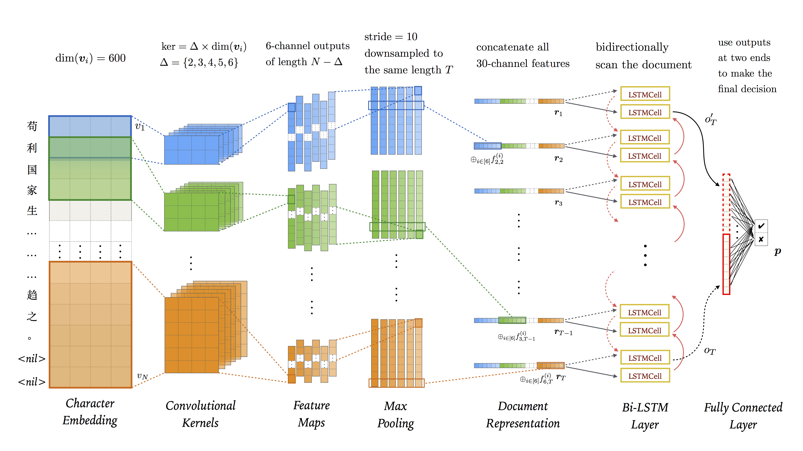

# Hierarchical Neural Model for Recommending Articles
### CS420 Coursework: Text Classification

In this coursework, I implemented various advanced neural network architectures for a binary text classification task. Based on several successful convolutional neural networks (CNN), I proposed a novel hierarchical neural model, which is compatible with inherent hierarchical properties of documents. The experiment shows that the proposed model outperforms conventional character-level CNNs for text classification on AUC criterion. Even without sufficient training, the stacking tricks integrating existing models help further improve the final performance in the in-class kaggle competition.

## Hierarchical Neural Model
In this coursework, I design a hierarchical neural model, which is shown below.

For detailed information and evaluation, see my final report [here](tex/5140309562_RunzheYang.pdf).

## Environment
I ran experiments on my PC.
- Operating System: CentOS Linux release 7.3.1611 (Core)
- CPU: Intel(R) Core(TM) i5-4460 CPU @ 3.20GHz
- No GPU
- Total Memory: 16142596 kB
The code is in Python 2.7 and I implemented neural networks with [PyTorch](http://pytorch.org).